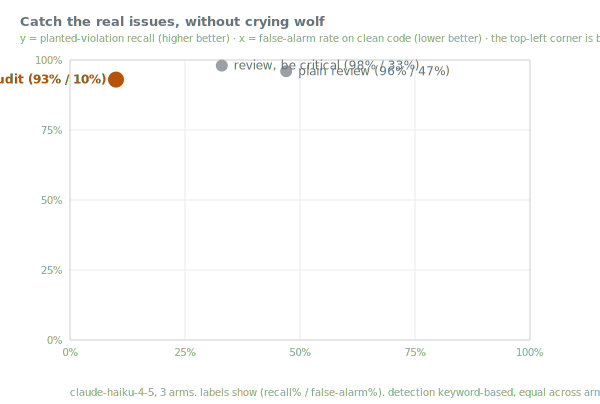

# eng-audit

**A Claude Code skill that audits your changes against nine engineering principles.**

Run it at a phase boundary (a feature shipped, a PR readied, a refactor finished) and it works
through the diff looking for concrete violations, verifies each one against the code, and reports
them worst-first with `file:line`, a severity, and a fix. It calls out what is clean too, so the
report is not only negative.

The principles, manifesto-style: **<https://humane-software-manifesto.netlify.app>**

## The nine principles

One philosophy: write as little as possible, keep impurity and coupling at the edges and visible, and
never astonish the next reader.

1. **Write less code.** Deletability is the metric. Easy-to-delete beats easy-to-change beats
   must-rewrite.
2. **Keep coupling visible: think connascence** (name → type → meaning → position → algorithm →
   timing). Prefer weaker, more local forms. Naming is design.
3. **Prefer functional over imperative.** Pure functions, referential transparency; mutation is the
   deliberate exception.
4. **Functional core, imperative shell.** Effects and I/O at the boundary, declared; the core stays pure.
5. **Least astonishment, then delight.** Surprise is a defect.
6. **Methods tell a story.** Collect input, do the work confidently, deliver, handle failure at the edges.
7. **Comments explain why, never what.**
8. **Hold tests to the highest standard.** A flaky or dishonest test is worse than none.
9. **No unspoken side effects: think downstream.** Name the blast radius before you ship.

## Install

```bash
# as a Claude Code plugin
/plugin marketplace add jah2488/eng-audit
/plugin install eng-audit@eng-audit

# or as a plain skill
git clone https://github.com/jah2488/eng-audit ~/eng-audit
ln -s ~/eng-audit/skills/eng-audit ~/.claude/skills/eng-audit
```

Then `/eng-audit` at the end of a phase.

## How it works

It scopes to what changed this phase plus what it touches (`git diff`, recent commits), verifies each
finding against the code, and tags severity:

- ⚠ correctness / astonishment
- ▲ structural (duplication, coupling, dead code, leaked side effect)
- ▽ minor / efficiency / polish

It leads with a headline (count + worst severity), lists findings worst-first grouped by principle,
and ends by asking which to fix. Trivial fixes it may just do; judgment calls it asks about first.

## Benchmark: catch the issues, clear the clean code

A code-review skill earns its keep by finding real problems without burying you in false alarms.
I measured both at once. Six small snippets carry planted violations of the principles (a leaked
side effect, a dead function, a missing validation, an in-place mutation, a tautological test, a
magic number, an over-abstraction). Six more are clean and documented. Three reviewers see each
one: a plain code review, the same review told to "be thorough and critical," and eng-audit. One
keyword detector scores all three identically, so the between-reviewer comparison is fair.

<p align="center">
  
</p>

Catching the planted violations is the easy part. All three reviewers land high, 93 to 98%; a
careful review already finds an obvious dead function or a missing check. The reviewers separate
on the clean code. Told to "be critical," the review manufactures defects on documented, correct
snippets a third of the time, and a plain review does so on nearly half. It calls a documented
`sum([])` a "critical issue, will crash on null," and a clamp with a stated contract "a bug."

eng-audit flags clean code at **10%**. It reads a documented contract as intentional and reports
"0 significant findings, this is clean" rather than inventing a problem to look thorough. It pays
a small recall cost for that discipline (93% against 96 to 98%): when it is unsure, it holds back.
That trade is the whole point. A reviewer you can trust to stay quiet on clean code is one whose
warnings you actually read.

_n=180 reviews on `claude-haiku-4-5`. The detector is keyword-based and applied identically to
every arm, so it measures a floor, not a ceiling. This is single-snippet review; eng-audit's
phase-boundary scoping over a real diff is not captured here. Reproduce it with
[`benchmarks/`](benchmarks/)._

## The benefit that compounds

The benchmark scores one review of one snippet. The larger reason to run eng-audit is what it does
to a codebase over time. Held to these principles, the model writes code that is easier to reason
about. Fewer dead branches get left lying around. There is less duplication. Side effects sit at
the edges where they stay visible. Code in that shape is also easier for the model itself to keep
working in. It trips over its own earlier choices less often, and it writes itself into a corner
less often, because the structure it left behind stays simple enough to extend. The advantage is
slight on a single file and grows across a whole codebase. That compounding is the purpose of the
audit at scale: keeping the code in a shape that both people and models can keep moving through.

## Lineage

Connascence, functional-core / imperative-shell, the principle of least astonishment, and Avdi
Grimm's *Confident Ruby* (principle 6). eng-audit is also one of four disciplines fused into
[flint](https://github.com/jah2488/flint), which runs them continuously rather than only at phase
boundaries. MIT licensed.
