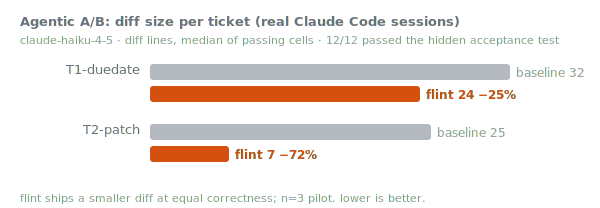

# eng-audit

**A Claude Code skill that audits your changes against nine engineering principles.**

Run it at a phase boundary (a feature shipped, a PR readied, a refactor finished) and it works
through the diff looking for concrete violations, verifies each one against the code, and reports
them worst-first with `file:line`, a severity, and a fix. It calls out what is clean too, so the
report is not only negative.

The principles, manifesto-style: **<https://humane-software-manifesto.netlify.app>**

## The nine principles

One philosophy: write as little as possible, keep impurity and coupling at the edges and visible, and
never astonish the next reader.

1. **Write less code.** Deletability is the metric. Easy-to-delete beats easy-to-change beats
   must-rewrite.
2. **Keep coupling visible: think connascence** (name → type → meaning → position → algorithm →
   timing). Prefer weaker, more local forms. Naming is design.
3. **Prefer functional over imperative.** Pure functions, referential transparency; mutation is the
   deliberate exception.
4. **Functional core, imperative shell.** Effects and I/O at the boundary, declared; the core stays pure.
5. **Least astonishment, then delight.** Surprise is a defect.
6. **Methods tell a story.** Collect input, do the work confidently, deliver, handle failure at the edges.
7. **Comments explain why, never what.**
8. **Hold tests to the highest standard.** A flaky or dishonest test is worse than none.
9. **No unspoken side effects: think downstream.** Name the blast radius before you ship.

## Install

```bash
# as a Claude Code plugin
/plugin marketplace add jah2488/eng-audit
/plugin install eng-audit@eng-audit

# or as a plain skill
git clone https://github.com/jah2488/eng-audit ~/eng-audit
ln -s ~/eng-audit/skills/eng-audit ~/.claude/skills/eng-audit
```

Then `/eng-audit` at the end of a phase.

## How it works

It scopes to what changed this phase plus what it touches (`git diff`, recent commits), verifies each
finding against the code, and tags severity:

- ⚠ correctness / astonishment
- ▲ structural (duplication, coupling, dead code, leaked side effect)
- ▽ minor / efficiency / polish

It leads with a headline (count + worst severity), lists findings worst-first grouped by principle,
and ends by asking which to fix. Trivial fixes it may just do; judgment calls it asks about first.

## Does it actually change the code?

eng-audit is one of four disciplines fused into [**flint**](https://github.com/jah2488/flint), where
these principles run continuously rather than only at phase boundaries. flint's agentic benchmark is
the closest measurement of the principles in action: real Claude Code sessions on a small repo,
gated by a hidden acceptance test.

<p align="center">
  
</p>

On the `PATCH` ticket, the principled run shipped a **72% smaller** diff at equal correctness by
*reusing the existing validator and store helper* (7 lines) where the unconstrained run rebuilt more
(25). That is principle 1 (write less, reuse over rebuild) and principle 2 (keep coupling local) made
measurable. It is an n=3 pilot, attributed to flint (which embeds these principles, among others),
not a standalone eng-audit score; the full methodology and caveats live in
[flint's benchmarks](https://github.com/jah2488/flint/tree/main/benchmarks).

## Lineage

Connascence, functional-core / imperative-shell, the principle of least astonishment, and Avdi
Grimm's *Confident Ruby* (principle 6). MIT licensed.
